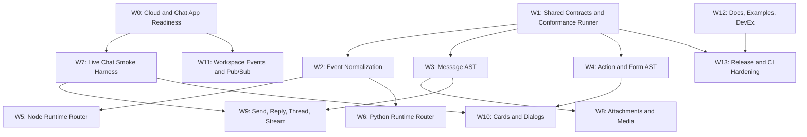

# Parallel Agent Workstreams

This plan splits Google Chat AI SDK work into independently executable chunks for many parallel agents. Each workstream has explicit ownership, start conditions, completion conditions, required tests, and live-test boundaries.

## Current Baseline

Repository:

- Git repo initialized on `main`.
- No commits yet.
- Node and Python packages exist with one shared event-normalization fixture.
- `pnpm test`, `pnpm build`, and `pnpm discovery:check` pass.

Cloud:

- Project ID: `chat-ai-sdk`.
- Project number: `123456789012`.
- Region: `us-central1`.
- Service account key moved to `~/.config/googlechatai-sdk/credentials/chat-ai-sdk-service-account.json`.
- `.env.local` exists locally and is ignored.
- `pnpm cloud:doctor` passes.
- `pnpm cloud:pubsub-smoke` passes.
- `pnpm chat:app-auth-smoke` currently fails with the expected `Google Chat app not found` error because the Chat app has not been configured in Cloud Console.
- Cloud Run service `chat-ai-sdk-dev-webhook` reports Ready, but its public `run.app` URL currently returns Google's outer `404` before reaching the container. Do not use it as a Chat endpoint until `/healthz` returns JSON.

## Global Rules For All Agents

Safety:

- Do not DM anyone.
- Do not invite real users into test spaces.
- Do not send messages to existing user/team spaces.
- Live Chat tests must use named spaces beginning `Google Chat AI SDK Smoke`.
- Do not paste or print service-account JSON, OAuth tokens, private keys, or access tokens.
- Do not commit `.env.local`, service-account keys, generated `dist/`, `node_modules/`, or Python bytecode.

Engineering:

- Keep Node and Python semantically aligned through shared fixtures and conformance cases.
- Every parser/orchestration change must add or update shared fixtures.
- Every new high-level behavior must define its capability/auth requirements.
- Prefer Google official clients/auth where practical, but keep Chat-specific semantics in our SDK.
- Raw payloads must remain accessible, but application handlers should use normalized objects.
- Treat AI context as a first-class product surface. Messages, quoted messages, replies, attachments, cards, reactions, transcriptions, and room/thread history must all become explicit context items with timestamps and plain-language metadata.
- Avoid bespoke nested logic for quotes or attachments. Use a scalable recursive/context-graph model where a message can contain quoted messages, attachments, attachment-derived content, and sender identity at any depth.
- Resolve message senders and participants into human-readable identity wherever auth allows: display name, email, user resource, app/bot/human type, and ambiguity or access limitations.
- All message content passed to AI must include temporal context: message create/update time, timezone when known, ordering, and whether the message is a thread reply, direct reply, quote, edit, or deletion marker.
- Every attachment passed to AI must include a plain-text system note with metadata before extracted content, for example: `System Note: The user attached image_123.png (image/png, 2.1 MB) with this message.`
- Every quote, reply, direct reply, forwarded/quoted reference, reaction, card action, or other user action should produce a plain-text system note for the AI explaining what occurred and who did it.
- Thread and room readers must support date filters, message limits, pagination, ordering, partial-result signaling, and clear AI-facing notes when history is truncated or inaccessible.
- Voice notes/audio attachments must support optional transcription providers, including OpenAI and Gemini, with explicit auth configuration, provider selection, and no transcription unless enabled.
- Agents adding dependencies must use the latest modern package versions available at implementation time unless a compatibility reason is documented. Latest package checks should be part of handoff notes.

Coordination:

- Each agent must claim exactly one workstream ID.
- Each agent should work in its own branch or worktree.
- Do not edit another workstream's owned files unless the plan says the files are shared.
- If a shared file needs changing, add a short note in the handoff explaining why.
- Before handoff, run that workstream's required checks plus `pnpm test`.

Standard handoff:

- Summary of changes.
- Files changed.
- Tests run and results.
- Live resources created or modified.
- Any blockers or follow-up gates.
- Package/dependency versions added and how freshness was checked.
- Confirmation that no real users were messaged or invited.

## Dependency Map



Workstreams can run in parallel except where a dependency is explicit. If a downstream workstream is started early, it should use local fixtures and mocks until its dependency is ready.

## Shared Validation Commands

Run from the repo root:

```bash
pnpm install --frozen-lockfile
pnpm test
pnpm build
pnpm discovery:check
```

Cloud smoke tests, only for agents with local `.env.local`:

```bash
set -a
source .env.local
set +a

pnpm cloud:doctor
pnpm cloud:pubsub-smoke
pnpm chat:app-auth-smoke
```

Expected current result:

- `cloud:doctor`: pass.
- `cloud:pubsub-smoke`: pass.
- `chat:app-auth-smoke`: fail until the Chat app is configured in Cloud Console.

## W0: Cloud And Chat App Readiness

Goal:

Make the Cloud project capable of receiving and testing real Google Chat app events in named test spaces.

Owned paths:

- `docs/runbooks/2026-06-29-google-cloud-project-setup.md`
- `tools/cloud/**`
- `tools/chat/**`
- `examples/cloud-run-node/**`
- `.env.example`
- Root `package.json` cloud/chat scripts

Start conditions:

- Repo baseline is available.
- Local `.env.local` points at the moved service-account key.
- `pnpm cloud:doctor` passes.
- `pnpm cloud:pubsub-smoke` passes.

Tasks:

- Resolve Cloud Run external URL routing so `/healthz` returns JSON from the container.
- Configure Google Chat app in Cloud Console or document the exact unautomatable fields.
- Set app name to `Google Chat AI SDK Dev`.
- Restrict visibility to safe test users only.
- Use the Cloud Run `/chat/events` endpoint only after `/healthz` passes.
- Keep direct-message testing disabled or explicitly out of scope.
- Verify service-account app auth with `pnpm chat:app-auth-smoke`.
- Create one named test space only if app-auth smoke requires it: `Google Chat AI SDK Smoke <date>`.

Completion conditions:

- `curl -sS "$BASE_URL/healthz"` returns JSON with `ok: true`.
- `pnpm chat:app-auth-smoke` passes without sending messages.
- If a test space is created, its resource name is saved in `.env.local` as `GOOGLE_CHAT_TEST_SPACE` and documented in the runbook.
- No DMs were sent.
- No real users were invited.

Required tests:

```bash
pnpm cloud:doctor
pnpm cloud:pubsub-smoke
pnpm chat:app-auth-smoke
curl -sS "$BASE_URL/healthz"
pnpm test
```

Live-test boundary:

- Allowed: enabling APIs, Cloud Run health checks, Pub/Sub smoke messages, creating one named test space.
- Not allowed: DMing users, inviting teammates, sending messages to real spaces.

## W1: Shared Contracts And Conformance Runner

Goal:

Turn the initial fixture idea into a real cross-language conformance system.

Owned paths:

- `spec/**`
- `fixtures/**`
- `conformance/**`
- `tools/conformance/**`
- Root `package.json` conformance scripts

Start conditions:

- `pnpm test` passes.
- Existing fixture `events.message-created.basic` passes in Node and Python.

Tasks:

- Define canonical JSON output rules for normalized events, messages, actions, attachments, errors, and capabilities.
- Add schemas:
  - `spec/actions.schema.json`
  - `spec/attachments.schema.json`
  - `spec/cards.schema.json`
  - `spec/capabilities.schema.json`
  - `spec/context.schema.json`
  - `spec/errors.schema.json`
  - `spec/identity.schema.json`
  - `spec/transcription.schema.json`
- Add a dependency-free conformance runner or a minimal Node runner.
- Make conformance runner invoke both Node and Python implementations.
- Add at least five event fixtures:
  - plain message
  - bot mention
  - slash command
  - card click
  - attachment message
- Add at least three AI-context fixtures:
  - quoted message with nested quoted content and nested attachments
  - thread reader with date range, limit, pagination, and truncation note
  - attachment system-note rendering for image/audio/document metadata
- Add expected normalized output for each fixture.

Completion conditions:

- `pnpm conformance` exists.
- `pnpm conformance` runs Node and Python against shared fixtures.
- At least five conformance cases pass in both languages.
- Context schemas cover recursive/nested message and attachment relationships without one-off quote-specific structures.
- Identity schema represents human-readable display, email when available, resource name, type, and access/ambiguity status.
- Docs explain how to add a fixture.

Required tests:

```bash
pnpm conformance
pnpm test
pnpm build
```

Live-test boundary:

- No live Google calls required. Use fixtures only.

## W2: Event Normalization

Goal:

Deeply normalize every inbound Google Chat event family into the shared envelope.

Owned paths:

- `packages/node/src/events.ts`
- `packages/python/src/googlechatai/events.py`
- `packages/node/test/events.test.ts`
- `packages/python/tests/test_events.py`
- Event-related fixtures under `fixtures/events/**`

Shared paths:

- `spec/events.schema.json`
- `conformance/cases/events*.json`

Start conditions:

- W1 has either landed or has provided enough fixture format guidance.
- Existing Node/Python normalization tests pass.

Tasks:

- Normalize direct Chat HTTP events.
- Normalize Pub/Sub-wrapped events.
- Normalize Workspace Events wrappers.
- Normalize card-click, dialog-submit, widget-update, slash-command, app-command, added-to-space, removed-from-space, reaction, membership, message-updated, and message-deleted events.
- Preserve raw event data.
- Generate stable event IDs and idempotency keys.
- Classify event kind using the taxonomy from the feature inventory.
- Attach event-time metadata and actor identity in a form usable by AI context builders.
- Preserve whether an event represents a quote, direct reply, thread reply, card action, reaction, edit, deletion, or other user action so context builders can emit system notes.
- Add edge-case fixtures for missing text, missing user, deleted message, and unknown event type.

Completion conditions:

- Node and Python produce identical normalized envelopes for all event fixtures.
- Unknown event types return `event.unknown` rather than throwing.
- Invalid non-object payloads throw typed errors in both languages.
- Event envelopes expose actor/sender identity in human-readable form where available, with explicit null/access-limited states where not.

Required tests:

```bash
pnpm conformance
pnpm test:node
pnpm test:python
pnpm test
```

Live-test boundary:

- Optional read-only capture from Cloud Run logs after W0 is complete.
- Do not send Chat messages for this workstream.

## W3: Message AST And Annotation Parser

Goal:

Convert Google Chat `Message` objects into a stable model-ready AST.

Owned paths:

- `packages/node/src/messages/**`
- `packages/python/src/googlechatai/messages/**`
- `packages/node/test/messages*.test.ts`
- `packages/python/tests/test_messages*.py`
- Message fixtures under `fixtures/messages/**`
- Context fixtures under `fixtures/context/**` when message nesting or AI context rendering is touched

Shared paths:

- `spec/messages.schema.json`
- `spec/context.schema.json`
- `spec/identity.schema.json`
- `fixtures/expected/messages/**`
- `fixtures/expected/context/**`

Start conditions:

- W1 fixture conventions are known.
- W2 exposes or can consume normalized message parser hooks.

Tasks:

- Parse text, formatted text, argument text.
- Parse user mentions.
- Parse slash command annotations.
- Parse custom emoji annotations.
- Parse matched URLs and rich links.
- Parse quoted message metadata.
- Parse quoted message contents when available, including nested quoted message sender, time, text, cards, and attachments.
- Represent nested quotes and nested attachments through a generic recursive context/message node model rather than quote-specific bespoke structures.
- Parse attached GIFs.
- Parse reaction summaries.
- Render `plainTextForModel`.
- Render AI-facing system notes for quotes, direct replies, thread replies, edits, deletion markers, and other message relationship metadata.
- Ensure every AI-facing message includes create/update time and sender identity in human-readable form.
- Preserve sender identity fields: display name, email when available, user resource, type, and access/ambiguity status.
- Preserve positional segments in occurrence order.
- Handle deleted/private/thread reply metadata.

Completion conditions:

- At least eight message fixtures cover annotations, links, commands, attachments placeholder, quoted messages, deleted messages, private messages, and GIFs.
- At least one fixture covers a quoted message with nested contents and nested attachments.
- AI context rendering includes sender, timestamp, relationship notes, and truncation/inaccessibility notes where applicable.
- Node and Python AST outputs match.
- Model text is deterministic and documented.

Required tests:

```bash
pnpm conformance
pnpm test
```

Live-test boundary:

- No live Google calls required. Use fixtures.

## W4: Action, Form, And Dialog AST

Goal:

Normalize card clicks, dialog submissions, widget updates, slash commands, and app commands into one action object.

Owned paths:

- `packages/node/src/actions/**`
- `packages/python/src/googlechatai/actions/**`
- `packages/node/test/actions*.test.ts`
- `packages/python/tests/test_actions*.py`
- Action fixtures under `fixtures/actions/**`

Shared paths:

- `spec/actions.schema.json`
- `fixtures/expected/actions/**`

Start conditions:

- W1 fixture conventions are known.
- W2 event envelope supports action payloads.

Tasks:

- Parse action method name.
- Parse hidden parameters.
- Parse string inputs.
- Parse multi-select inputs.
- Parse date/time/date-time inputs.
- Parse switch/checkbox inputs.
- Parse user and space picker outputs when present.
- Preserve unknown form fields.
- Represent validation errors.

Completion conditions:

- At least six action/form fixtures pass in Node and Python.
- Card-click and dialog-submit outputs use the same normalized action shape.
- Unknown fields are preserved.

Required tests:

```bash
pnpm conformance
pnpm test
```

Live-test boundary:

- No live Google calls required until W7/W10.

## W5: Node Runtime Router

Goal:

Make the Node package usable as a real app runtime for Google Chat events.

Owned paths:

- `packages/node/src/router/**`
- `packages/node/src/adapters/**`
- `packages/node/test/router*.test.ts`
- `examples/node-*/**`

Shared paths:

- `packages/node/src/index.ts`
- `docs/guides/**`

Start conditions:

- W2 event normalization API is stable enough for handler input.

Tasks:

- Implement `GoogleChatAI` or equivalent runtime entrypoint.
- Add handler registration: `onMessage`, `onMention`, `onCardClicked`, `onDialogSubmitted`, `onUnknownEvent`.
- Add middleware chain.
- Add Fetch API handler.
- Add Express/Fastify/Hono adapters or at least Fetch plus one framework adapter.
- Add synchronous JSON response helper for Chat events.
- Add handler-context extension points for AI-ready context loading: current message, quoted-message tree, thread history, room history, attachments, sender identities, timestamps, and relationship system notes.
- Add error handling and structured logs.

Completion conditions:

- Example Node app can accept fixture POSTs locally.
- Router dispatches to correct handler by normalized event kind.
- Handler context exposes reply placeholders but does not send live messages yet.
- Router code does not hardcode bespoke nested quote/attachment traversal; it delegates to context/message/attachment modules.

Required tests:

```bash
pnpm test:node
pnpm build
pnpm test
```

Live-test boundary:

- Local fixture POSTs only unless W0 is complete.

## W6: Python Runtime Router

Goal:

Make the Python package usable as a real app runtime for Google Chat events.

Owned paths:

- `packages/python/src/googlechatai/router/**`
- `packages/python/src/googlechatai/adapters/**`
- `packages/python/tests/test_router*.py`
- `examples/python-*/**`

Shared paths:

- `packages/python/src/googlechatai/__init__.py`
- `docs/guides/**`

Start conditions:

- W2 event normalization API is stable enough for handler input.

Tasks:

- Implement `GoogleChatAI` or equivalent runtime entrypoint.
- Add decorators: `@chat.on_message`, `@chat.on_card_clicked`, `@chat.on_unknown_event`.
- Add async handler support.
- Add FastAPI adapter.
- Add Flask or ASGI adapter if lightweight.
- Add synchronous JSON response helper for Chat events.
- Add handler-context extension points for AI-ready context loading: current message, quoted-message tree, thread history, room history, attachments, sender identities, timestamps, and relationship system notes.
- Add error handling and structured logs.

Completion conditions:

- Example Python app can accept fixture POSTs locally.
- Router dispatches to correct handler by normalized event kind.
- Handler context exposes reply placeholders but does not send live messages yet.
- Router code does not hardcode bespoke nested quote/attachment traversal; it delegates to context/message/attachment modules.

Required tests:

```bash
pnpm test:python
pnpm test
```

Live-test boundary:

- Local fixture POSTs only unless W0 is complete.

## W7: Live Chat Smoke Harness

Goal:

Create safe live tests against Google Chat without messaging real users.

Owned paths:

- `tools/chat/**`
- `tools/live-smoke/**`
- `fixtures/live/**`
- `docs/runbooks/**`

Start conditions:

- W0 is complete or the agent owns W0 and can complete it.
- Chat app is configured.
- `pnpm chat:app-auth-smoke` passes.

Tasks:

- Add a live smoke runner with explicit `RUN_LIVE_CHAT_SMOKE=1` guard.
- Ensure it refuses to run unless `GOOGLE_CHAT_TEST_SPACE` starts with `spaces/`.
- Add a dry-run mode that prints planned API calls.
- Add create/list/get/delete safe resource tests.
- Add message send/edit/delete test only in the named smoke space.
- Add cleanup logic for messages created by the smoke runner.
- Record live evidence without saving message body secrets.

Completion conditions:

- `RUN_LIVE_CHAT_SMOKE=1 pnpm live:chat-smoke` passes in a named test space.
- Runner refuses to run without explicit env guard.
- Runner refuses to target DMs or unknown spaces.
- Runbook includes exact cleanup steps.

Required tests:

```bash
pnpm test
RUN_LIVE_CHAT_SMOKE=1 pnpm live:chat-smoke
```

Live-test boundary:

- Allowed: named smoke space only.
- Not allowed: DMs, inviting users, external spaces, real team spaces.

## W8: Attachments And Media

Goal:

Implement attachment metadata normalization, safe download/upload planning, and parser hooks.

Owned paths:

- `packages/node/src/attachments/**`
- `packages/python/src/googlechatai/attachments/**`
- `packages/node/test/attachments*.test.ts`
- `packages/python/tests/test_attachments*.py`
- `fixtures/attachments/**`

Shared paths:

- `spec/attachments.schema.json`
- `spec/transcription.schema.json`
- `spec/context.schema.json`
- `fixtures/expected/attachments/**`

Start conditions:

- W3 message AST can expose attachments or the agent adds compatible hooks.

Tasks:

- Normalize attachment metadata.
- Expose media resource names.
- Add safe filename handling.
- Add size/type policy objects.
- Add download plan generation without live download.
- Add upload plan generation without live upload.
- Add parser hook interface for text, PDF, image, audio.
- Add optional voice-note/audio transcription module interface with provider adapters for OpenAI and Gemini. Do not require either provider at install time unless the package design intentionally separates optional extras.
- Evaluate existing modern packages for audio decoding/transcription helpers before implementing custom media handling. Document package versions and why chosen.
- Add AI-facing attachment metadata notes before extracted content, including original filename, content type, size when known, source, and whether extraction/transcription was skipped, partial, or blocked.
- Support nested attachment extraction from quoted messages or thread-history messages through the same generic attachment/context model used for top-level messages.
- Add security policy defaults.

Completion conditions:

- Node and Python output identical attachment metadata for fixtures.
- Unsafe filenames are sanitized.
- Download/upload methods support dry-run plans.
- Voice-note transcription is provider-optional and auth-explicit, with tests proving disabled-by-default behavior.
- Attachment AI context output includes both metadata note and extracted/transcribed content status.
- Live download/upload is gated behind W7 and explicit env flags.

Required tests:

```bash
pnpm conformance
pnpm test
```

Live-test boundary:

- No live media download/upload until W7.

## W9: Send, Reply, Thread, And Stream

Goal:

Implement high-level outbound messaging orchestration and conversation-reading primitives with dry-run first.

Owned paths:

- `packages/node/src/messages/**`
- `packages/python/src/googlechatai/messages/**`
- `packages/node/src/threads/**`
- `packages/python/src/googlechatai/threads/**`
- `fixtures/api-responses/**`
- `conformance/cases/messages*.json`

Start conditions:

- W1 exists.
- W3 message refs are stable enough.
- W7 is required only for live send tests.

Tasks:

- Implement call-plan generation for:
  - send to space
  - send to user by email
  - find or setup DM
  - reply in current thread
  - start thread
  - read thread context
  - read room/space context
  - edit message
  - delete app-created message
  - stream by create plus patch
- Add capability checks for auth modes and scopes.
- Add request ID and client message ID generation.
- Add update-mask generation.
- Add streaming throttle policy.
- Add dry-run output for every operation.
- Add thread and room readers that support date filters, message limits, pagination, ordering, page cursors, partial-result state, and explicit inaccessible/truncated history notes.
- Ensure read outputs are AI-context-ready: every message includes sender identity, timestamp, relationship metadata, and system notes for replies/quotes/attachments/actions.
- Ensure quoted/replied-to messages can be recursively included up to a configurable depth, using generic context nodes and safeguards against cycles or runaway nesting.

Completion conditions:

- Dry-run call plans pass conformance in Node and Python.
- Thread/room read plans and mocked read outputs pass conformance in Node and Python.
- Pagination, date range, limit, ordering, and truncation semantics are documented and covered by fixtures.
- No live send happens unless explicitly requested through live smoke.
- Streaming patch sequence has golden fixtures.

Required tests:

```bash
pnpm conformance
pnpm test
```

Live tests after W7:

```bash
RUN_LIVE_CHAT_SMOKE=1 pnpm live:chat-smoke -- --messages
```

Live-test boundary:

- Named smoke space only.
- Created messages must be cleaned up or clearly labeled.

## W10: Cards, Dialogs, And Rich Objects

Goal:

Provide typed card builders/parsers and common AI workflow cards.

Owned paths:

- `packages/node/src/cards/**`
- `packages/python/src/googlechatai/cards/**`
- `packages/node/test/cards*.test.ts`
- `packages/python/tests/test_cards*.py`
- `fixtures/cards/**`

Shared paths:

- `spec/cards.schema.json`
- `fixtures/expected/cards/**`

Start conditions:

- W4 action AST exists or is stubbed.
- W9 outbound dry-run call plans exist for card sends.

Tasks:

- Build common card primitives.
- Add approval card builder.
- Add progress card builder.
- Add error card builder.
- Add form/dialog builder.
- Add card JSON validation.
- Parse inbound cards into summaries for model context.
- Render AI-facing system notes for card clicks, button choices, dialog submissions, widget updates, and form values, including actor identity and event time.
- Add fallback text generation.

Completion conditions:

- Golden card fixtures pass in Node and Python.
- Every card builder emits fallback text.
- Approval/progress/error cards have examples.
- Card/action context notes are deterministic and suitable to feed to an AI alongside message context.

Required tests:

```bash
pnpm conformance
pnpm test
```

Live tests after W7:

```bash
RUN_LIVE_CHAT_SMOKE=1 pnpm live:chat-smoke -- --cards
```

Live-test boundary:

- Named smoke space only.
- No interactive approvals involving real users.

## W11: Workspace Events And Pub/Sub

Goal:

Implement Workspace Events/Pub/Sub ingestion and checkpoint handling.

Owned paths:

- `packages/node/src/workspace-events/**`
- `packages/python/src/googlechatai/workspace_events/**`
- `tools/workspace-events/**`
- `fixtures/workspace-events/**`

Start conditions:

- `pnpm cloud:pubsub-smoke` passes.
- W2 event normalization can accept Pub/Sub/Workspace Events wrappers.

Tasks:

- Parse Pub/Sub push payloads.
- Parse Pub/Sub pull payloads.
- Parse Workspace Events Chat resource events.
- Add checkpoint interface.
- Add subscription config docs.
- Add local pull smoke command for existing dev subscription.

Completion conditions:

- Pub/Sub wrapper fixtures normalize through W2.
- Pull smoke can publish and consume synthetic events.
- Docs explain how to create/renew real Workspace Events subscriptions when allowed.

Required tests:

```bash
pnpm cloud:pubsub-smoke
pnpm conformance
pnpm test
```

Live-test boundary:

- Pub/Sub synthetic messages are allowed.
- Do not subscribe to broad real Workspace events until privacy and retention policy is documented.

## W12: Docs, Examples, And Developer Experience

Goal:

Make the repo legible and usable for outside contributors and future agents.

Owned paths:

- `README.md`
- `docs/guides/**`
- `docs/examples/**`
- `examples/**`, except examples actively owned by W5/W6/W0
- `AGENTS.md`

Start conditions:

- Initial repo scaffold exists.

Tasks:

- Add quickstart for local fixture tests.
- Add quickstart for cloud project setup.
- Add Node example guide.
- Add Python example guide.
- Add "how to add fixture" guide.
- Add "how to run live smoke safely" guide.
- Add guide for AI context rendering requirements: timestamps, human-readable sender identity, quoted-message nesting, attachment metadata notes, truncation notes, direct/thread reply notes, reactions, and card actions.
- Add guide for optional voice-note transcription setup with OpenAI and Gemini, including auth requirements and disabled-by-default behavior.
- Add architecture overview from feature inventory.
- Keep docs source-backed and avoid promising incomplete features as shipped.

Completion conditions:

- A new agent can read README plus this plan and start a workstream.
- Docs distinguish implemented, scaffolded, and planned features.
- All examples referenced by docs exist or are marked planned.
- Docs explicitly state that all AI-bound message/context content must include time, sender identity, relationship metadata, and attachment/quote system notes.

Required tests:

```bash
pnpm test
pnpm build
```

Live-test boundary:

- Docs only. No live Google calls required.

## W13: CI, Release, And Repository Hygiene

Goal:

Harden the repo for parallel development and eventual package publication.

Owned paths:

- `.github/**`
- Root `package.json`
- `pnpm-lock.yaml`
- `tsconfig.base.json`
- `packages/*/pyproject.toml`
- Release tooling under `tools/release/**`

Start conditions:

- Initial scaffold exists.

Tasks:

- Ensure CI runs Node tests, Python tests, build, discovery check, and conformance once W1 lands.
- Add package-content checks.
- Add dependency freshness checks or a documented `npm view`/package-registry verification workflow for every dependency added by agents.
- Ensure current package versions remain modern. As of 2026-06-29, root package/dev dependencies were verified current on npm: `pnpm@11.9.0`, `typescript@6.0.3`, `vitest@4.1.9`, `@types/node@26.0.1`. Python build backend freshness was verified on PyPI: `hatchling@1.30.1`.
- Add lint/format commands if they do not create churn.
- Add branch/PR checklist.
- Add secret scanning guard.
- Add generated-file ignore checks.
- Add package naming/license decision checklist.

Completion conditions:

- CI workflow matches local validation commands.
- `pnpm install --frozen-lockfile` passes.
- Secret/material ignore checks are documented.
- Dependency freshness check or documented handoff requirement exists for npm, Python, Docker base images, and optional provider packages.
- Repo has a clear pre-merge checklist.

Required tests:

```bash
pnpm install --frozen-lockfile
pnpm test
pnpm build
pnpm discovery:check
```

Live-test boundary:

- No live Google calls required.

## Suggested Parallel Assignment Order

Start immediately:

- W1: Shared contracts and conformance runner.
- W2: Event normalization.
- W3: Message AST.
- W4: Action/form AST.
- W12: Docs and examples.
- W13: CI/repo hygiene.

Start once W0 is picked up:

- W0: Cloud and Chat app readiness.
- W11: Workspace Events and Pub/Sub.

Start after W1 plus relevant parser foundations:

- W5: Node runtime router.
- W6: Python runtime router.
- W8: Attachments and media.
- W9: Send/reply/thread/stream.
- W10: Cards/dialogs/rich objects.
- W7: Live Chat smoke harness.

## Definition Of Done For Any Workstream

An agent is done only when:

- Owned code/docs are updated.
- Shared fixture or conformance changes are included when behavior changes.
- Required tests pass, or failures are documented with exact command output.
- Live tests, if any, are run only within the declared boundary.
- No secrets are printed or committed.
- No real users are messaged or invited.
- Handoff notes include start state, final state, tests, and remaining risks.
